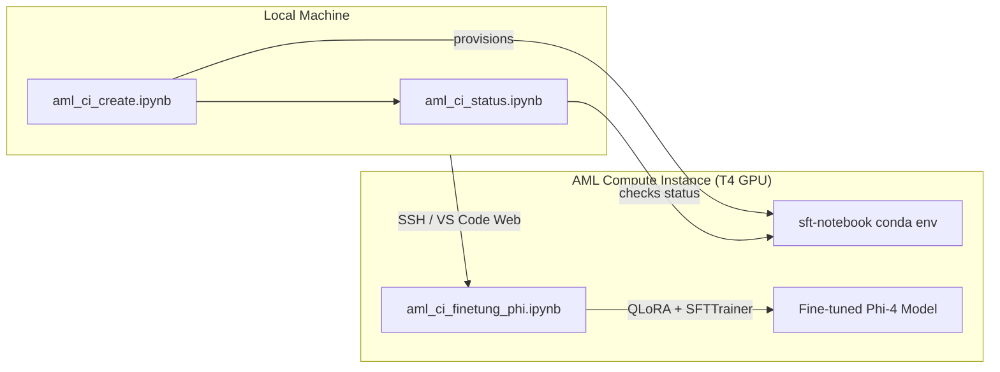

# Quick Start

Set up a local Python environment to provision and manage an AML GPU Compute Instance for Phi-4 fine-tuning.

> Disclaimer: This is a learning/sample artifact — not production hardened.

---

## Prerequisites

- Python 3.14+
- Azure CLI (`az login` authenticated)
- An SSH key pair (see [docs/00-prerequisites.md](docs/00-prerequisites.md))

---

## 1. Create Local Environment

### Linux / macOS

```bash
# 1. Navigate to the compute instance directory
cd model-fine-tuning/01-compute-instance

# 2. Create venv, activate, and install dependencies
python3.14 -m venv .venv && source .venv/bin/activate
python3.14 -m pip install --upgrade pip
python3.14 -m pip install -r deploy_requirements.txt

# 3. Register a Jupyter kernel
python3.14 -m ipykernel install --user --name=.venv --display-name "Python (.venv)"
```

### Windows (PowerShell)

```powershell
# 1. Navigate to the compute instance directory
cd model-fine-tuning\01-compute-instance

# 2. Create venv, activate, and install dependencies
python3.14 -m venv .venv
.\.venv\Scripts\activate
python3.14 -m pip install --upgrade pip
python3.14 -m pip install -r deploy_requirements.txt

# 3. Register a Jupyter kernel
python3.14 -m ipykernel install --user --name=.venv --display-name "Python (.venv)"
```

---

## 2. Configure Environment

```bash
cp config/.env.example config/.env
```

Edit `config/.env` with your Azure subscription, resource group, workspace, and SSH key name.

---

## 3. Run the Notebooks

Open the notebooks in VS Code or JupyterLab using the **Python (.venv)** kernel:

| Notebook | Purpose |
|----------|---------|
| `aml_ci_create.ipynb` | Provision a GPU Compute Instance with custom conda env |
| `aml_ci_status.ipynb` | Check Compute Instance status |
| `aml_ci_finetung_phi.ipynb` | Fine-tune Phi-4-mini-instruct (run **on the CI**, not locally) |

### Workflow



---

## License

See root [LICENSE](../LICENSE).