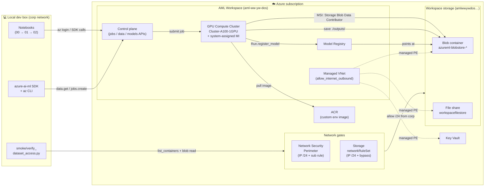
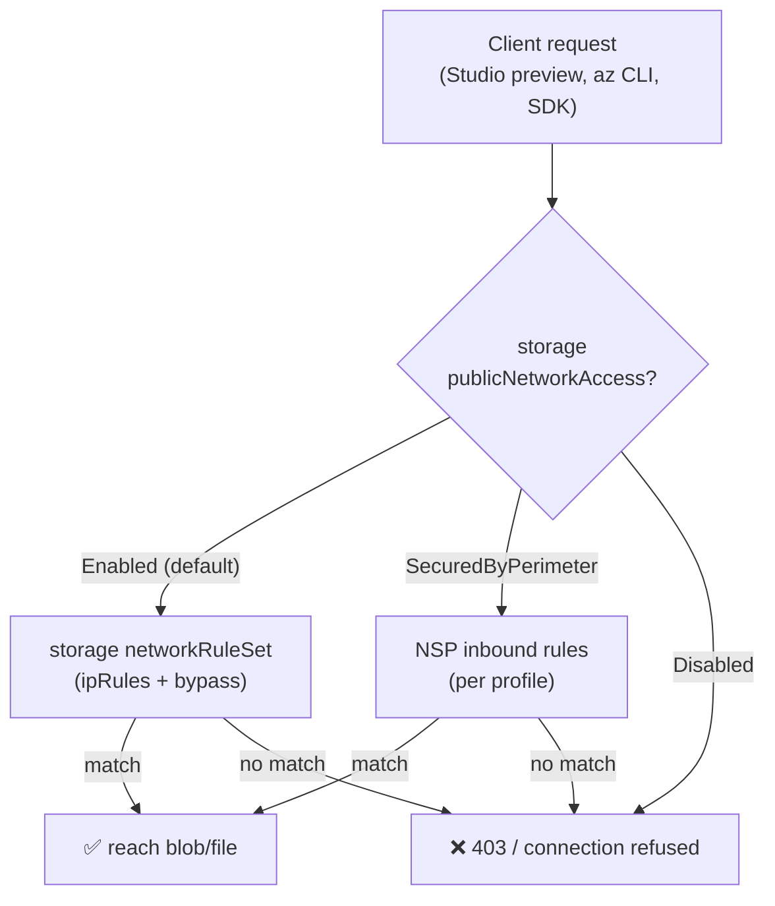
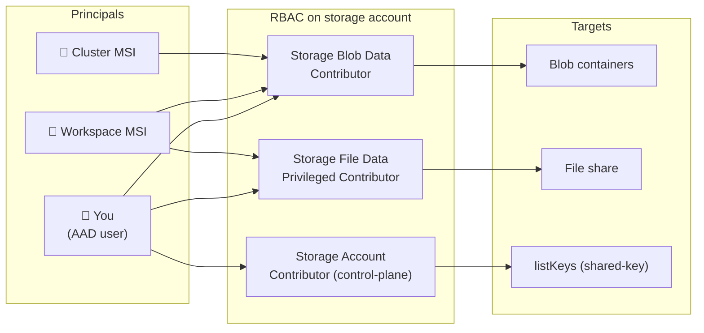
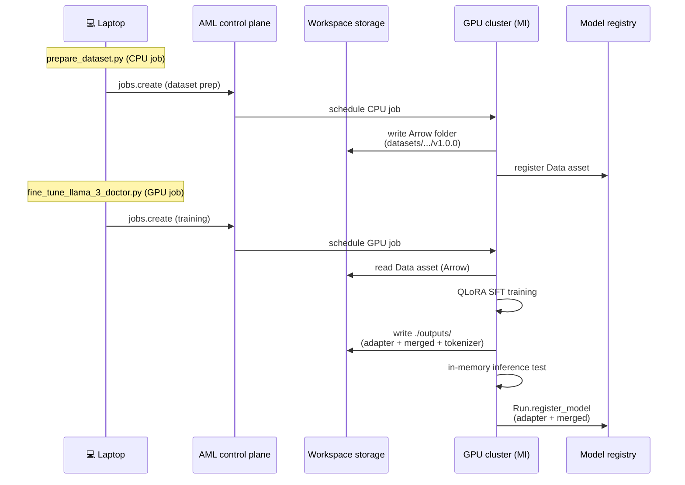

# Architecture — Compute Cluster fine-tuning workflow

End-to-end view of the network, identity, and data flows in this project.
Use it as a mental map when something fails so you know which layer to check.

---

## 1. End-to-end workflow



**Read this as**: your laptop talks to the AML control plane and (separately)
to storage's data plane through two independent firewalls (NSP + storage
`networkRuleSet`). The compute cluster lives inside the workspace's managed
VNet and reaches storage via system-installed private endpoints — it does
**not** depend on your laptop's IP at all.

---

## 2. Why both NSP and storage firewall?



The 00 prep notebook configures `publicNetworkAccess=Enabled`, which means
**the storage `networkRuleSet` is authoritative** for direct data-plane
traffic. NSP is still useful for NSP-gated paths and as documentation of
allowed networks, but **Step 2c (storage firewall sync) is what actually
unblocks the AML Studio preview and any laptop-direct blob access**.

---

## 3. Identity / RBAC matrix



Three principals, three roles. The most common gap is the **cluster MSI →
Storage Blob Data Contributor** assignment — Step 3 of the 00 prep notebook
fixes that.

---

## 4. Two-stage data flow at training time



The two jobs are intentionally split: dataset prep needs no GPU, training
needs an A100 — keeps cost down and the GPU job pure-training.

---

## 5. Storage layout

```
amlwwywdos1036066399.blob.core.windows.net/
└── azureml-blobstore-<workspace-id>/
    ├── datasets/
    │   └── ai-medical-chatbot-llama3/
    │       └── v1.0.0/                         ← Data asset (HF Arrow)
    │           ├── dataset_dict.json
    │           ├── train/data-00000-of-00001.arrow
    │           └── test/data-00000-of-00001.arrow
    └── ExperimentRun/dcid.<run-id>/outputs/
        ├── llama3-8b-chat-doctor/              ← LoRA adapter + tokenizer
        ├── llama3-8b-chat-doctor_config/       ← LoRA config
        ├── llama3-8b-chat-doctor_full/         ← Merged model + tokenizer
        └── sample_inference.json
```

Both `./outputs/` folders get auto-uploaded by AML, then `Run.register_model`
in `fine_tune_llama_3_doctor.py` creates registry entries pointing at the
uploaded paths.

---

## See also

- [Troubleshooting — Studio data preview](troubleshooting-studio-preview.md)
- [Prep notebook (`00_aml_cc_prepare_sub_environment.ipynb`)](../00_aml_cc_prepare_sub_environment.ipynb)
