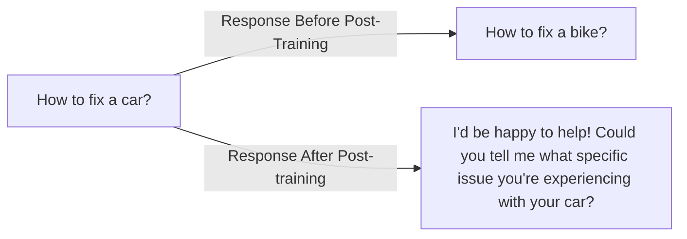

## Evolution of Post-Training

| Year | Key Concepts| Models |
|:---|:---|:---|
| 2020 | Fine-tuning, Pre-Training |T5|
| 2021 | Preference Learning, InstructGPT, RLHF|ChatGPT|
| 2022 | Multi-objective RL, Tool use, Constitutional AI (RLAIF) | GPT-4, Claude 1-3 |
| 2023 | Reasoning, CoT training, Code Execution | GPT4o, GPT o1/o3, Claude 4, DeepSeek r1/v3 |

## Model response before and after post-training

