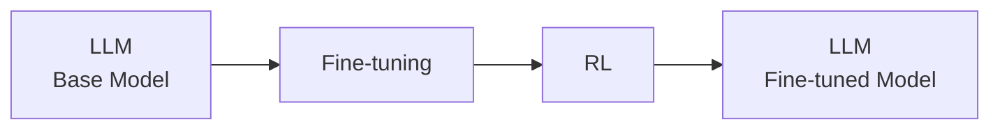

# Intuition 

## SFT - data
model is mimic every step of the output.

It just works to mimic your data. Need good data upfront at scale.

## RLHF - grading
goal is to get to the right final result. Do whatever thing in between.

Can develop superhuman capabilities!

## Comparision table
||Data|Grader|Stability|Compute|
|:---|:---|:---|:---|:---|
| **Fine-tuning** | Good {input, output} data upfront  *May be hard to gather at scale* | - | More stable | Less compute, with efficient methods|                                  
| **RL** | Input data | Good graders   *May be hard to create and tune* | Less stable| More compute |

## Frontiers labs combine the best of both

Frontier Labs combine the best of both worlds. 

A base model, pre-trained model will go through fine-tuning to learn some of the patterns first and then go through reinforcement learning to actually learn some additional ways to solve the same problems and to solve it in its own way more efficiently and better.